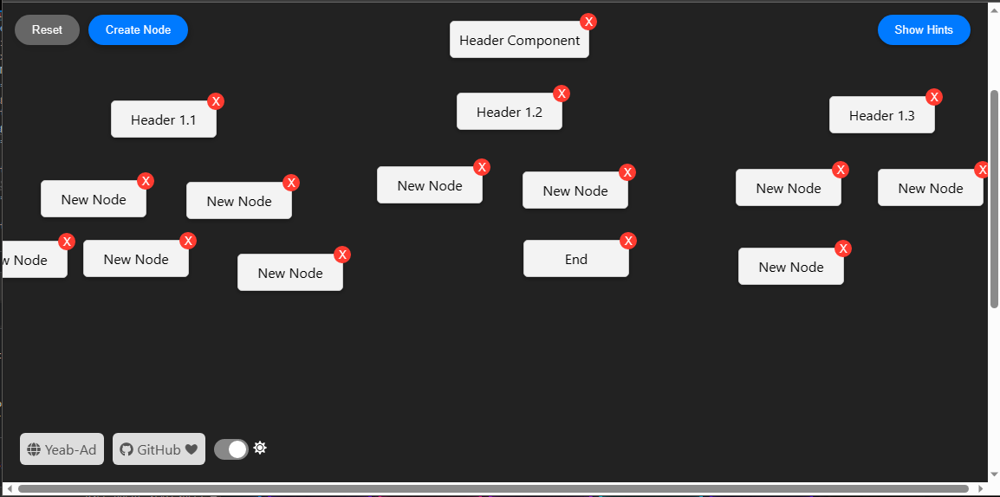

# Node Effect✌

Node Effect✌ is an awesome app for organizing and managing draggable nodes!

<center>
  <div>
    <p>Dark Mode</p>
    
  </div>
</center>

## Features

- Create draggable nodes on the screen
- Drag and drop nodes to reposition them
- Double-click nodes to edit their names
- Save changes made to node names
- Reset the app to remove all nodes

## Getting Started

To run Node Effect✌ locally, follow these steps:

1. Clone the repository:

   ```bash
   git clone https://github.com/your-username/node-effect.git

   ```

2. Navigate to the project directory:

   ```bash
    cd node-effect

   ```

3. Install the dependencies:

   ```bash
    npm install

   ```

4. Start the development server:

   ```bash
    npm start
    Open your web browser and visit http://localhost:3000 to see the app in action.
   ```

## Technologies Used

- React: A JavaScript library for building user interfaces.
- TypeScript: A typed superset of JavaScript that compiles to plain JavaScript.
- CSS: Cascading Style Sheets for styling the app.
- HTML: The markup language used for structuring the app.

## Contributing

Contributions are welcome! If you find any issues or want to add new features, feel free to open a pull request.

## License

This project is licensed under the MIT License.
